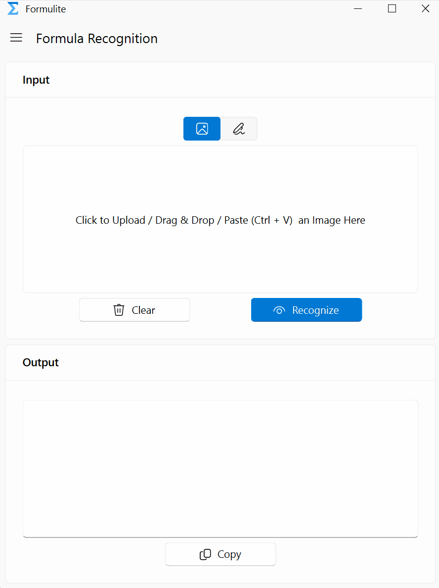
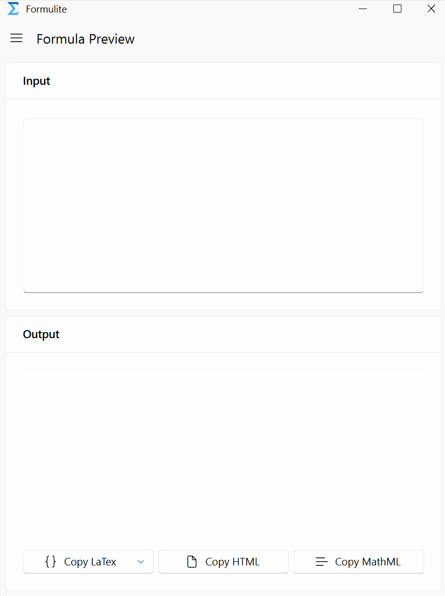
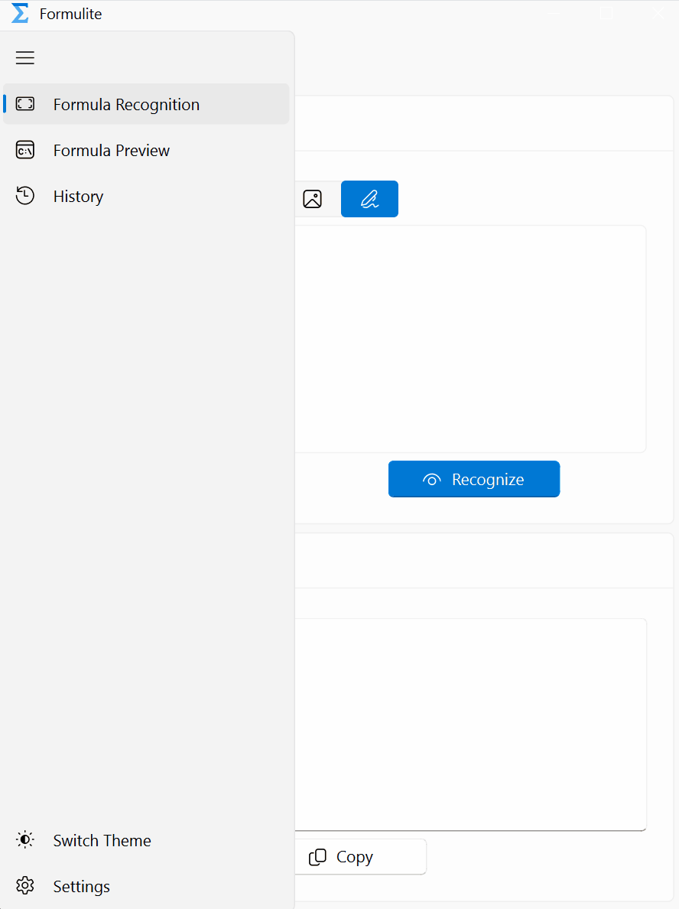

<p align="center">
  
</p>
<h1 align="center">Formulite</h1>

<p align="center">
A streamlined tool for rapid recognition and visualization of LaTeX formulas, built with PyQt and PyQt-Fluent-Widgets.
</p>

## Demo

**Formula Recognition**



**Formula Preview**



**Personalization**



## Features

- **LaTeX Formula Recognition**: Easily input formulas through image upload, drag-and-drop, copy-paste, or handwriting on a digital pad. With just a click, Formulite recognizes the formula and displays the result.
- **Real-time Formula Preview**: Type in your LaTeX code and see the formula rendered in real-time. A perfect tool for checking your work or preparing academic content.
- **Customizable Settings**: Switch between light and dark themes, change the theme color, modify language settings, configure APIs, and access help and feedback, all from within the app.
- **(Upcoming) History Tracking**: Keep track of your formula recognition and preview history for easy access and reference. *(Note: This feature is in development and will be available in future updates.)*

## QuickStart

Download the latest executable from the [Releases page](https://github.com/wytili/Formulite/releases).

After downloading, double-click the executable file to start the application.

## Start from Source

```sh
python main_window.py
```

